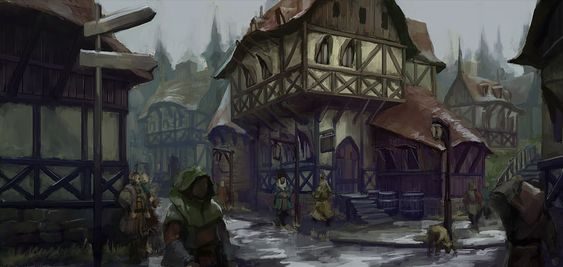
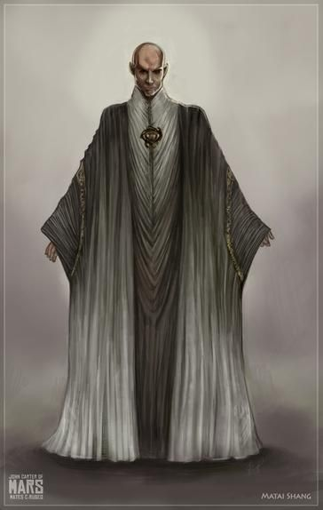
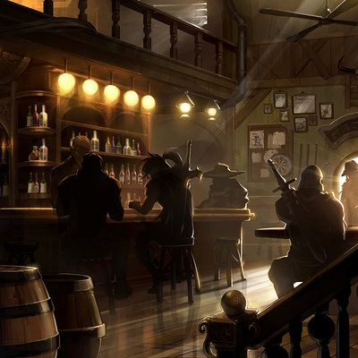
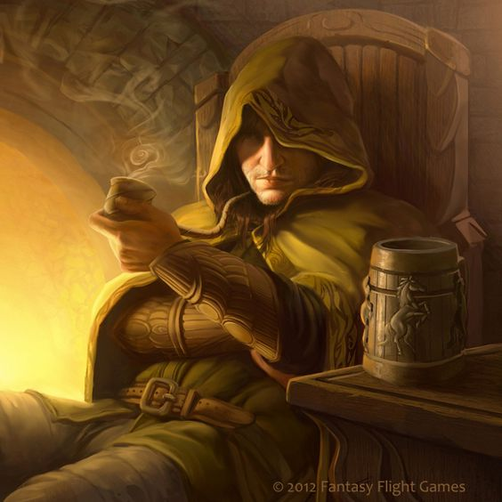
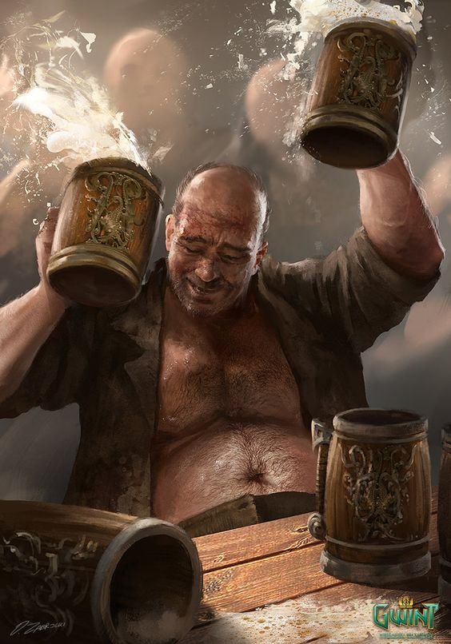
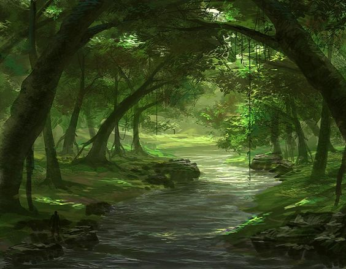

# Moonlight adventure (résumé de la partie) ⚔ 

ZZZZZZzzzz

ZZZZZZZZZZZZZzzzzzzz 

ZZZZZZZZZzzzzzzz

ZZZZZZZZZZZZZzzzzzzz 

ZZZZZZZZZzzzzzzz (il serait temps de se lever quand même)

ZZZZZZZZZZZZZzzzzzzz 

ZZZZZZZZZzzzzzzz (non vraiment, levez vous.)

ZZZZZZZZZZZZZzzzzzzz 

ZZZZZZZZZzzzzzzz (dernier avertissement, tu vas le regretter. Ma patience à des limites.)

Mouaaaahhh ! Il est temps de se lever ! 

Vous vous dirigez vers l&#39;imposante armoire en bois pour vous habiller. Plusieurs choix de tenues s&#39;offrent à vous :

Vous avez donc choisi votre classe ! Vous serez un(e) Nain, et obtenez un bonus en courage mais un malus en charisme. 

Vous vous retrouvez face à un carrefour, que faites vous ?

Vous vous dirigez vers l&#39;église... 

Sur le chemin vous rencontrez un prêtre qui vous interpèle discrètement

Il vous explique de sa voix tremblotante : 

Bonjour jeune aventurier. Vous semblez plein de fougue, c&#39;est pourquoi je voudrais vous charger de la quête suivante : un groupe de mercenaire occupe le village et terrifie les habitants, vous devez nous aider à s&#39;en débarasser !

*hmm interessant... que faire ?* 

Voulez vous accepter la quête ?

*J&#39;aimerais bien en savoir plus...* 

Votre interlocuteur reprend : &#39;Les mercenaires sont des vagabonds et ont souvent été aperçus vers la forêt, pensez a y jeter un coup d&#39;oeil.&#39;

*La forêt...* 

avec ces informations, souhaitez vous accepter la quête ?

*Une bonne occasion de gagner un peu d&#39;argent* 

Vous decidez donc d&#39;accepter la quête. que comptez vous faire ?

*une petite binouze ça n&#39;a jamais fais de mal à personne* 

Arrivé à la taverne, vous observez une peu les lieux, une pièce ronde avec sur votre gauche le bar.  N&#39;oubliez pas que vous êtes ici pour chercher des informations

 

Vous aperçevez au fond, un homme reclus tout seul à une table dans un coin sombre. Vous allez le voir... ce qui signifie que vous allez devoir passer un test de charisme.

 

Epreuve de charisme :

Vous réussissez à lui soutirer des informations précises sur la quête ! 

-Je les ai croisés il y a de ça 10 min, ils sortaient de la taverne, après avoir bu plusieurs pintes chacun, ils étaient 2 et ils criaient sur tous les toits qu&#39;ils se dirigeaient vers la forêt au nord pour rentrer dans leur bivouac

 

Apres avoir récupéré ses informations, l&#39;homme vous propose une petite bière, qu&#39;en dites vous ?

Non merci, je doit rester concentré ... 

Vous sortez de l&#39;auberge et vous dirigez vers la forêt

 

Arrivé à la lisère de la forêt, vous cherchez des indices en observant les alentours

 

Vous devez effectuer un test de perception pour réussir votre observation

vous observez de grandes traces de pas, ceux des mercenaires, les traces sont toutes fraîches 

Il faut maintenant faire une épreuve de courage pour vérifier si vous êtes prêt à vous battre !

 

Epreuve de courage :

vous perdez vos moyens devant les mercenaires et ils en profitent pour attaquer 

Le combat va démarrer ! Préparez vous !

Malgré une lutte acharnée, vos forces sont trop faibles et les deux hommes s&#39;unissent pour vous affliger le coup de grâce, vous tombez à terre, le paysage autour de vous s&#39;assombrit ... VOUS ETES MORT ☠ 

c&#39;est la fin du chapitre Moonheart town, merci d&#39;avoir joué, le prochain chapitre est bientôt disponible !

 

